<!-- Wavy Header -->

  

<!-- Typing -->

  

  
  
  

---

  

---

## Now

<table>
  <tr>
    <td width="50%" valign="top">
      <h3>🏢 더즌</h3>
      

        해외 <b>가상계좌 · 펌뱅킹 중계</b> 플랫폼을 만들고 있습니다. 
        운영자가 매일 쓰는 D-Banking 대시보드를 React 19로 설계하고,
        거래 조회·정산·엑셀·통계는 물론, 복잡한 거래 설정과 기관 온보딩까지 쉽게 사용할수 있는 UI 를 구현합니다.
      

      

        <code>자금이체 FT</code> · <code>가상계좌 VA</code> · <code>원장 / 정산</code>
      

    </td>
    <td width="50%" valign="top">
      <h3>🎓 국민대 · AI</h3>
      

        국민대학교 소프트웨어융합대학원에서 인공지능을 공부하고 있습니다. 
        지금은 <b>가치평가 예측모델</b> 관련 연구를 하고 있습니다.
      

      

        <code>XGBoost</code> · <code>Embedding MLP</code> · <code>실거래 시계열</code>
      

    </td>
  </tr>
</table>

---

## Featured Work

<table>
  <tr>
    <td width="48%" valign="top">
      <h3>🖥️ D-Banking Admin Front</h3>
      

        해외 가상계좌·자금이체 대시보드 
        React 19 / Vite / TypeScript / Tailwind 4 / TanStack Query·Table / Zustand.
      

      <ul>
        <li>거래·상태·수수료·원장·정산 화면을 하나의 어드민으로 구성</li>
        <li>10만 행 엑셀을 브라우저에서 만들 때 <b>56초 → 11초</b> 로 개선</li>
        <li>셀 스타일 병목 제거 + Web Worker로 UI 프리징 제거</li>
      </ul>
    </td>
    <td width="4%"></td>
    <td width="48%" valign="top">
      <h3>⚙️ D-Banking Admin API</h3>
      

        대시보드 API  
        Spring Boot 3 / QueryDSL / PostgreSQL.
      

      <ul>
        <li>거래관련 조회 API 의 공통 조회 패턴 재설계로 병목 개선</li>
        <li>마지막 페이지 <b>32초 → 1.6초</b>, 검색 <b>6초 → 0.8초</b> 로 개선</li>
        <li>엑셀 10만 건 <b>11초 → 3초</b> 로 개선 </li>
      </ul>
    </td>
  </tr>
</table>

 

<table>
  <tr>
    <td valign="top">
      <h3>🏠 Valuation Model — 전세가 예측</h3>
      

        아파트 매매·전세 실거래가를 결합해 <b>전세가 / 전세가율</b>을 예측하는 연구 프로젝트.
        물건과 단지 특성에 따라 학습 구간을 나누고, one-hot 의존을 embedding으로 개선.
      

      

        <code>Python</code> · <code>XGBoost</code> · <code>Embedding MLP</code> · <code>시계열 분할</code>
      

    </td>
  </tr>
</table>

---

## Stack

  

  
  
  
  
  
  
  
  
  
  
  
  

---

  

